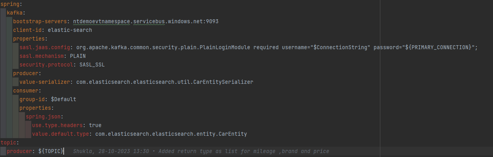
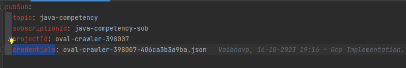

**Table of Contents**

1.[Introduction](#introduction)

2.[Prerequisites](#prerequisites)

3.[Local Setup](#localsetup)
    
4.[Deploy Elastic Search](#deploy-elastic-search)

**Introduction**

In this application we have integrated two cloud service i.e Azure Eventhub and Gcp PubSub.
In this application we are listening events from Azure Eventhub and Gcp as per the profile and saving 
it into Elasticsearch.We have also exposed endpoint which will fetch the data from elasticsearch and give the 
response accordingly.

**Prerequisites**

 Azure Setup:
1. Azure Account.
2. EventHub Primary ConnectionString

GCP Setup:
1. Gcp Account
2.  PubSub Credentials like  topic,subscriptionId,projectId,credentials

For Elasticsearch:
1. Hostname
2. Port

**Local Setup**

1. Provide the Credentials for Azure or Gcp

 **Azure**
    

**GCP**

2. Use Docker command to up the elasticsearch.

        docker-compose up

3. Set the Profile either azure or gcp
   
        java -jar -Dspring.profiles.active=azure ElasticSearchApplication.jar
4. Start the Application 

**Deploy Elasticsearch on Azure**

#Login to Azure in Local

az login

#Create Resource Group

az group create --name $resourceGroupName --location $resourceLocation

#Create an AKS Cluster with default setting

az aks create --resource-group $resourceGroupName --name $clusterName

#Get the Kubernetes Configuration to run further commands

az aks get-credentials --resource-group $resourceGroupName --name $clusterName

#Run this command to install CRDS

kubectl create -f https://download.elastic.co/downloads/eck/2.9.0/crds.yaml

#Download the required repo for elastic

kubectl apply -f https://download.elastic.co/downloads/eck/2.9.0/operator.yaml

#Apply the deployment File

kubectl apply -f elastic-deployment.yaml

#Once Pod is up take the Cluster Ip and add it into the elastic-svc.yaml file

kubectl apply -f elastic-svc.yaml

